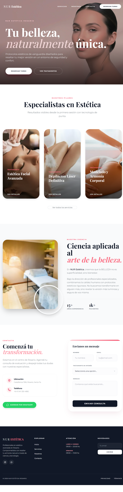
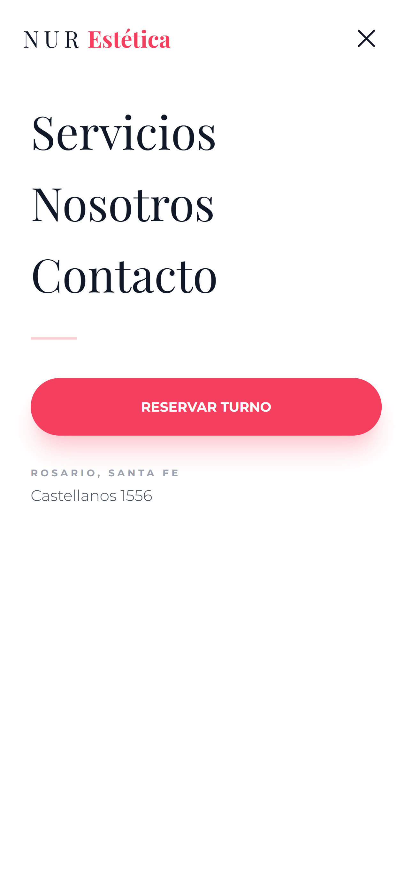
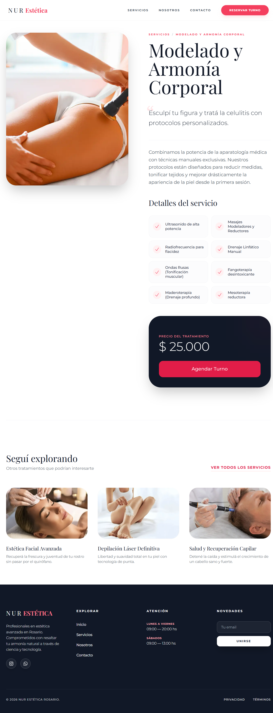
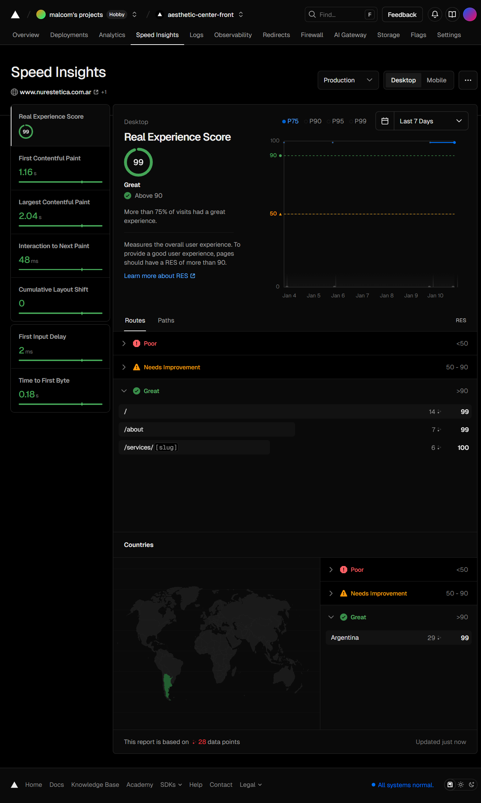
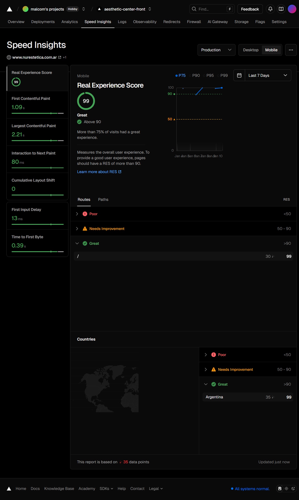

# 🌿 NUR Aesthetic — Rosario, ARG


**NUR Aesthetic** is a high-performance web application designed for a premium beauty center in Rosario, Argentina. 

This project was built with a strong focus on **Local SEO**, **Core Web Vitals**, and a **Data-Driven Architecture** to ensure scalability and ease of maintenance.

---

## 📸 Project Gallery

### 🎨 User Interface & Experience
<div align="center">
  
</div>

<br>

| **📱 Mobile Responsiveness** | **✨ Dynamic Service Pages** |
| :---: | :---: |
|  |  |
| *Smooth transitions & backdrop blur* | *Auto-generated pages based on data* |

---

### ⚡ Performance Metrics (Core Web Vitals)
Achieving a **100/100 score** on Google Lighthouse was a core requirement for this project to ensure top-tier SEO ranking in Rosario.

| **Desktop Performance** | **Mobile Performance** |
| :---: | :---: |
|  |  |

---

## 🚀 Key Features

### 🔍 Advanced SEO & Discovery
-   **Dynamic Metadata:** Automatically generates unique `title` and `description` tags for every service page based on the data layer, targeting local keywords (e.g., *"Laser Hair Removal in Rosario"*).
-   **Automated Sitemap:** A server-side `sitemap.ts` that updates in real-time as new treatments are added to the code.
-   **JSON-LD Schema:** Integration of `LocalBusiness` structured data to boost visibility in Google Maps and search results.

### 🎨 UI/UX Design System
-   **Premium Aesthetic:** Features a custom color palette (`Rose-400`/`Neutral-900`) and typography (`Playfair Display` & `Geist`) to reflect the brand's identity.
-   **Responsive & Interactive:** Fully responsive layouts with smooth micro-interactions (hover effects, mobile menu animations) built with Tailwind CSS.
-   **Performance First:** Optimized images using `next/image` with priority loading strategies for LCP (Largest Contentful Paint) optimization.

---

## 🏗️ Data Architecture & Scalability

The project follows a **Data-Driven** approach to facilitate content management without a heavy CMS:

-   **Centralized Data Source:** All clinical treatments and services are managed through a centralized typed constant (`TREATMENTS_DATA`). This allows for updating prices, descriptions, or images in a single file, automatically reflecting changes across the Navbar, Service Pages, and SEO metadata.
-   **Dynamic Routing:** Leveraging Next.js App Router (`/services/[slug]`), the application generates unique pages for each treatment on-demand.
-   **Type Safety:** Strict TypeScript implementation for service definitions ensures that any missing data (like a missing image or description) is caught at compile-time, preventing production runtime errors.

---

## 🛠️ Tech Stack

-   **Framework:** [Next.js 15 (App Router)](https://nextjs.org/)
-   **Styling:** [Tailwind CSS](https://tailwindcss.com/) + `tailwind-merge` for component flexibility.
-   **Language:** [TypeScript](https://www.typescriptlang.org/)
-   **Icons:** [Heroicons](https://heroicons.com/)
-   **Deployment:** [Vercel](https://vercel.com/) (Edge Network)

---

## 📦 Local Development

To run this project locally, follow these steps:

1.  **Clone the repository:**
    ```bash
    git clone [https://github.com/your-username/nur-aesthetic-studio.git](https://github.com/your-username/nur-aesthetic-studio.git)
    ```

2.  **Install dependencies:**
    ```bash
    npm install
    # or
    yarn install
    ```

3.  **Run the development server:**
    ```bash
    npm run dev
    ```

4.  Open [http://localhost:3000](http://localhost:3000) with your browser to see the result.

---

## 📂 Project Structure

```bash
├── app/                # Next.js App Router (Pages & API)
│   ├── services/       # Dynamic Service Routes ([slug])
│   ├── sitemap.ts      # Dynamic XML Sitemap generation
│   └── robots.ts       # SEO crawling rules
├── src/
│   ├── components/     # Reusable UI components (Navbar, Button, etc.)
│   └── data/           # Centralized Data Layer (treatments.ts)
├── public/             # Static assets (images, fonts)
└── tailwind.config.ts  # Design System configuration
```

---

## 👤 Author
m4lcom | University Technician in Programming (UTN Rosario)

Built with passion and clean code principles.
